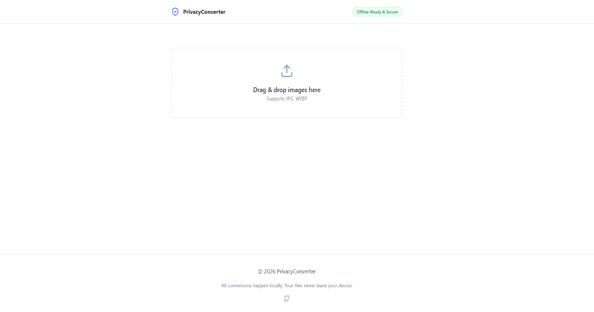

<div align="center">

# Secure Converter

*The secure, client-side image tool that respects your data.*

[🚀 Launch App](https://secure-jpg-to-png.pages.dev)


</div>

## Hero Visual



## Why Another Converter?

Most online converters upload your sensitive files to a remote server. You have no control over who sees them.

This tool uses WebAssembly and Canvas API to process images 100% locally. Your files never leave your browser memory.

## Key Features

- 🔒 **Privacy First**: Zero server uploads.
- ⚡ **Blazing Fast**: No upload/download wait times.
- 📂 **Bulk Processing**: Drag & drop 100+ images at once.
- 📦 **Offline Ready**: Installable PWA that works without Wi-Fi.

## Tech Stack

- Vite
- React
- TypeScript
- Tailwind CSS
- Zustand

## Quick Start

```bash
git clone https://github.com/AmineAce/privacy-converter.git
cd privacy-converter
npm install
npm run dev
```
