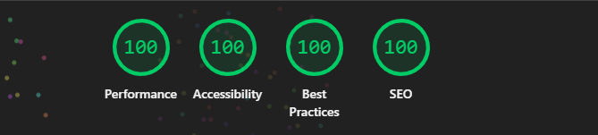

# Secure Converter

The privacy-first, client-side file manipulation tool.

[](https://opensource.org/licenses/MIT)
[](https://reactjs.org/)
[](https://github.com/AmineAce/privacy-converter)

[View Live Demo](https://secure-jpg-to-png.pages.dev)


## Why

Modern file converters are privacy nightmares - they're bloated with ads, trackers, and upload your files to remote servers for processing, compromising your privacy and security. This tool was built to solve that problem by running 100% in your browser using WebAssembly and Canvas technology. Your files never leave your device, ensuring complete privacy and security.

## Features

- ✅ **Universal Conversion**: Support for JPG, PNG, WebP, SVG, and HEIC (iPhone).
- ✅ **PDF Tools**: Convert images to PDF and Merge multiple images into a single PDF document.
- ✅ **Zero Limits**: No file size limits (process 1GB+ files locally).
- ✅ **Batch Engine**: Parallel processing for unlimited files.
- ✅ **Strict Privacy**: No data collection, no server storage.

## ⚡ 100/100 Performance



Secure Converter is optimized for speed. By running entirely client-side and using lazy-loading for heavy modules (HEIC/PDF), we achieve perfect Lighthouse scores across Performance, Accessibility, Best Practices, and SEO.

## Tech Stack

- **Frontend**: React + TypeScript + Vite 6
- **State**: Zustand (with atomic selectors)
- **Engine**: HTML5 Canvas + jspdf + heic-to (lazy loaded)
- **Styling**: Tailwind CSS

## Running Locally

```bash
git clone https://github.com/AmineAce/privacy-converter.git
cd privacy-converter
npm install
npm run dev
